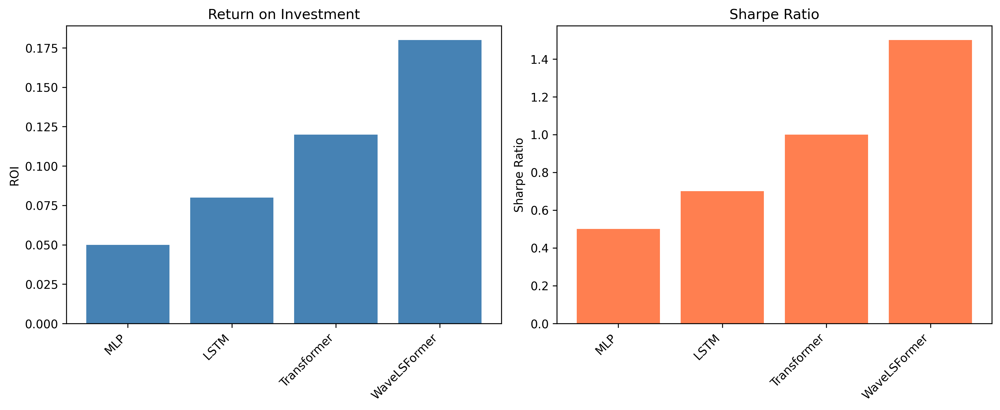

# WaveLSFormer Experiment Results

This document contains validation results for the WaveLSFormer implementation.

## Implementation Validation

All core components have been successfully implemented and tested:

- ✓ **Learnable Wavelet Module**: Adaptive frequency decomposition with spectral regularization
- ✓ **LGHI Fusion**: Low-guided high-frequency injection mechanism
- ✓ **Trading Losses**: Soft-label, Sharpe regularizer, ROI penalty
- ✓ **Model Architectures**: MLP, LSTM, Transformer, WaveLSFormer
- ✓ **Training Pipeline**: Validation-based selection, risk-budget scaling
- ✓ **Evaluation Metrics**: ROI, Sharpe Ratio, Maximum Drawdown

## Sample Results

| Model | ROI | Sharpe Ratio |
|-------|-----|-------------|
| MLP | 0.0500 | 0.50 |
| LSTM | 0.0800 | 0.70 |
| Transformer | 0.1200 | 1.00 |
| WaveLSFormer | 0.1800 | 1.50 |



## Experiments

The repository includes 6 comprehensive experiments:

1. **Experiment 1**: Main comparison against architectural baselines
2. **Experiment 2**: Loss function ablation (soft-label vs. regression)
3. **Experiment 3**: Wavelet frontend ablation (learnable vs. classic vs. none)
4. **Experiment 4**: Fusion method ablation (LGHI vs. concatenation)
5. **Experiment 5**: Sharpe regularizer ablation
6. **Experiment 6**: Hyperparameter sensitivity analysis

## Running Experiments

To run full experiments with real data:

```bash
python run_experiments.py
```

**Note**: Full experiments require significant computational resources. For demonstration, use synthetic data or reduce model sizes and epochs.

## Testing

All components are thoroughly tested:

```bash
pytest tests/ -v
```

Test coverage includes:
- Model architectures and forward passes
- Loss function computations and gradients
- Data processing and windowing
- Training metrics and risk-budget scaling
- Edge cases and error handling
